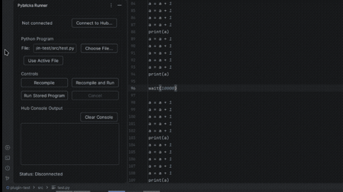

# Pybricks-Runner

An Intellij/Pycharm plugin that provides a clean gui for interacting with pybricks hubs. 

## Demo


# Usage
Uvx is required to interact with [brickpipe](https://github.com/shaggysa/brickpipe). You can find installation instructions [here](https://docs.astral.sh/uv/getting-started/installation/).

## Installation
1: Navigate to the [releases](https://github.com/shaggysa/pybricks-runner/releases) tab in the github repository and select the latest release

2: Scroll down to `Assets` and download the `pybricks-runner-[version].zip` asset.

3: Open Pycharm/Intellij and navigate to `IDE and Project Settings`->`Plugins`->`Manage Repositories, Configure Proxy, or Install Plugin from Disk`(next to `Installed` on the top bar)->`Install Plugin from Disk`.

4: Select the zip archive.

### Build from source (optional)
1: Clone the repo.
```bash
git clone https://github.com/shaggysa/pybricks-runner.git
cd pybricks-runner
```

2: Build the project.
```bash
./gradlew buildPlugin
```

3: The archive should reside in build/distributions. Proceed to installation steps 4 and 5.

### AI disclosure notice
The gui code was largely written with assistance from LLMs. 
However, the python adapter process and IPC format are entirely my own design.